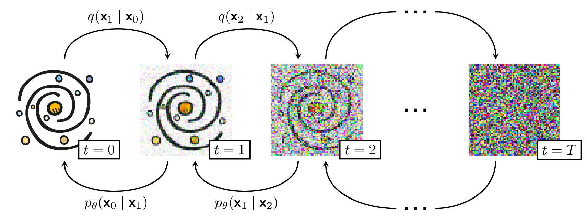

<p align="center">
    </img>
</p>

## Realistic galaxy simulation via score-based generative models

Official code for 'Realistic galaxy simulation via score-based generative
models'.  We use a score-based generative model to produce realistic galaxy
images.  This implementation is based off of Phil Wang's <a
href="https://github.com/lucidrains/denoising-diffusion-pytorch">PyTorch
version</a> which is in turn transcribed from Jonathan Ho's official
Tensorflow version <a
href="https://github.com/hojonathanho/diffusion">here</a>. 

Below are some outputs from our model. Half of these galaxies are real and half
are generated. Check out the paper for the answer key.

<p align="center">
    
</p>

## Downloading and preprocessing the datasets

Downloading the PROBES dataset is straightforward:

1. `cd data/probes/ && mkdir raws gals`
2. `bash get_probes.sh`
3. `python preprocess.py`

Downloading the SDSS dataset is a little more finicky since it is so large. Here we
speed up the process via GNU Parallel (so make sure it is installed!):

1. `cd data/sdss/ && mkdir raws gals`
2. `bash wrangle_csv.bash`
3. `python preprocess.py`

## Running the code

### Training

Once your datasets are downloaded you can train by running:

`python train.py --dataset $DATASET --milestone $MILESTONE`

where `$DATASET` is either probes or sdss, and `$MILESTONE` is the global step of 
a trained model that you want to continue from. If there is no previous training
run, it is set as 0.

### Inference

To run inference on your trained model you can do:

`python infer.py --dataset $DATASET --milestone $MILESTONE --batches $BATCHES`

where `$DATASET` is either probes or sdss, and `$MILESTONE` is the global step of 
a trained model that you want to infer from. `$BATCHES` is the number of batches we
want to process (batch size is set as 96 here but can be changed within `infer.py`).

## This Galaxy/APOD Does Not Exist

More galaxies can be found <a href="http://mjjsmith.com/thisisnotagalaxy">here</a>.

We also used a DDPM to generate fake <a href="https://apod.nasa.gov/">Astronomy
Picture Of the Day</a> imagery.
<a href="http://mjjsmith.com/thisisnotanapod">Check it out.</a>

## Citing

If you find this work useful please consider citing our paper:

```bibtex
@article{smith2021,
    title={Realistic galaxy image simulation via score-based generative models},
    author={Michael J. Smith and James E. Geach and Ryan A. Jackson and Nikhil Arora and Connor Stone and St{\'{e}}ephane Courteau},
    journal = {arXiv e-prints},
    year={2021},
    eprint = {2111.01713}
}
```

Also be sure to check out Jonathan Ho's implementation here:

```bibtex
@article{ho2020,
    author = {{Ho}, Jonathan and {Jain}, Ajay and {Abbeel}, Pieter},
    title = "{Denoising Diffusion Probabilistic Models}",
    journal = {arXiv e-prints},
    year = 2020,
    eprint = {2006.11239},
}
```

And Jascha Sohl-Dickstein's original DDPM paper:

```bibtex
@article{sohl-dickstein2015,
    author = {{Sohl-Dickstein}, Jascha and {Weiss}, Eric A. and {Maheswaranathan}, Niru and {Ganguli}, Surya},
    title = "{Deep Unsupervised Learning using Nonequilibrium Thermodynamics}",
    journal = {arXiv e-prints},
    year = 2015,
    eprint = {1503.03585}
}
```

## Contributing

AstroDDPM is free software: you can redistribute it and/or modify it under the
terms of the GNU Affero General Public License as published by the Free
Software Foundation, either version 3 of the License, or (at your option) any
later version.

AstroDDPM is distributed in the hope that it will be useful, but WITHOUT ANY
WARRANTY; without even the implied warranty of MERCHANTABILITY or FITNESS FOR A
PARTICULAR PURPOSE. See the GNU Affero General Public License for more details.

You should have received a copy of the GNU Affero General Public License along
with AstroDDPM. If not, see https://www.gnu.org/licenses/.
